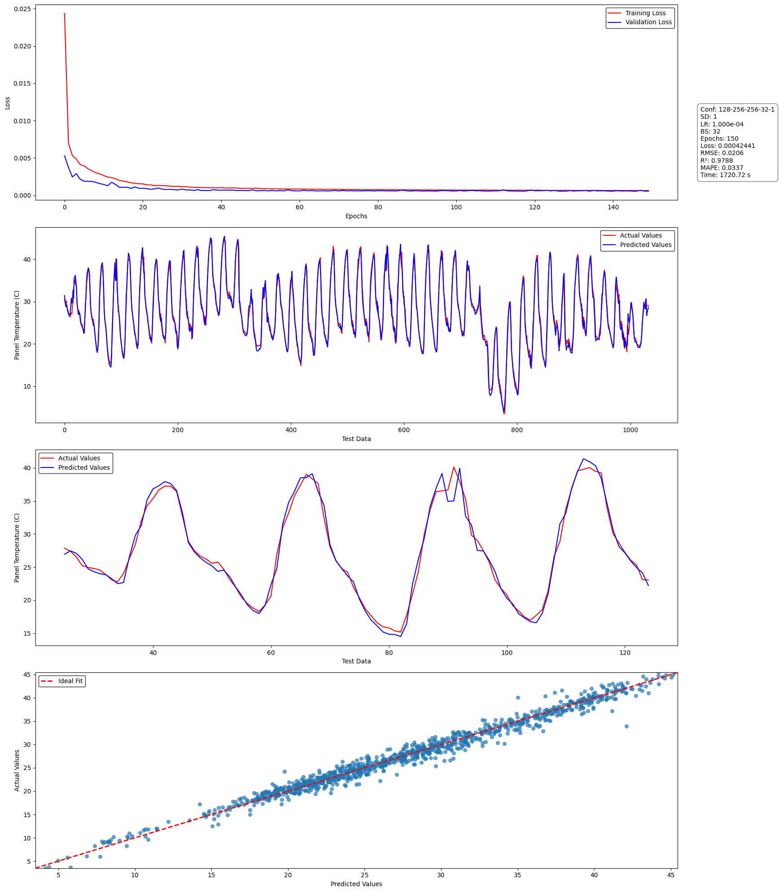
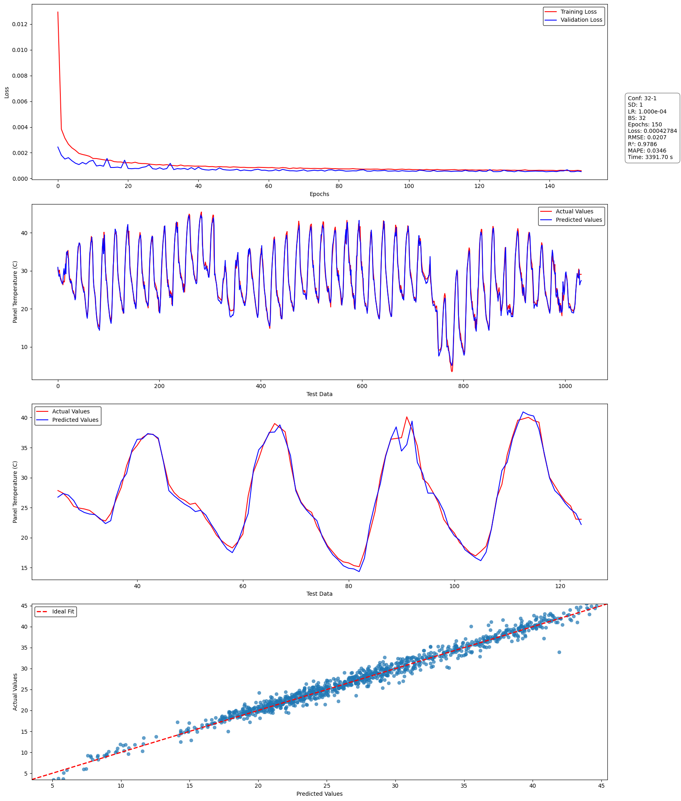
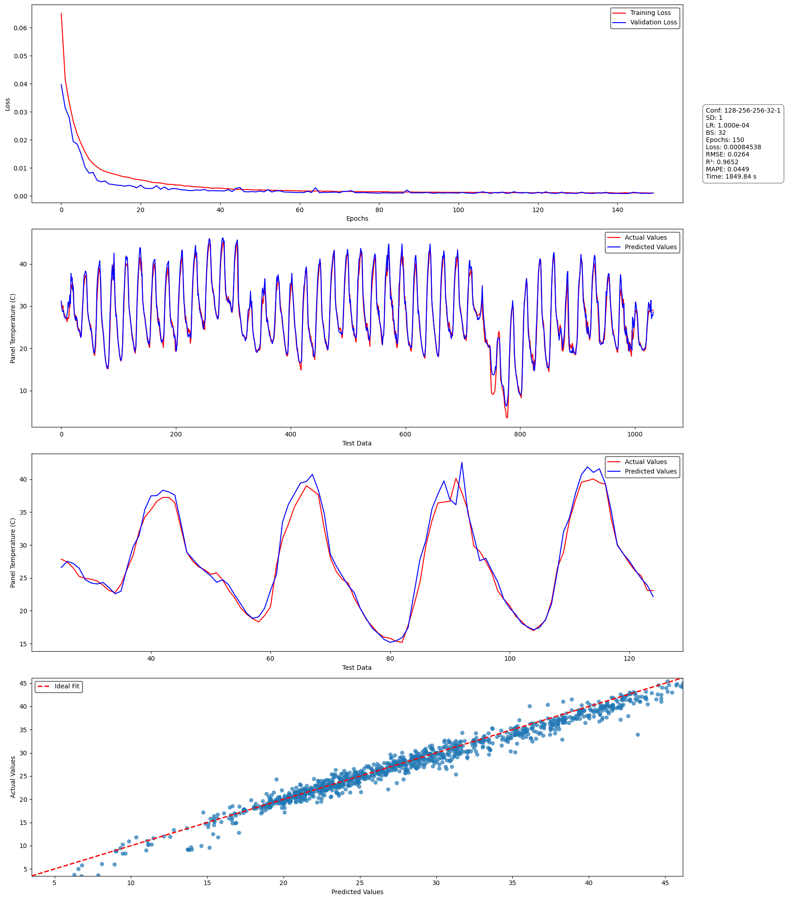

# Time Series Prediction using LSTM with Attention Optimization

This repository contain the implementation of my research about prediction of photovoltaic module temperature using LSTM-Attention

## dataset
- kaggle: https://www.kaggle.com/datasets/tecsci/brazilian-pv-dataset

## Requirements
- Python >= 3.10
- Jupyter Notebook

## Instalation
run this following code
```bash
git clone https://github.com/MAHafizh/pv-module-temperature-prediction.git
```
```bash
cd pv-module-temperature-prediction
```
```python
pip install requirements
```

## Result of Research

| Model            | Loss   | RMSE  | R2   |MAPE (%)|Runtime (s)|
|------------------|--------|-------|------|---------|-----------|
| LSTM             |0.000424|0.0206 |0.9787|3.37     |1720       |
| BILSTM           |0.000427|0.02068|0.9785|3.46     |3391       |
| LSTM-ATT         |0.000845|0.02636|0.9652|4.49     |1849       |

## Result Visualization

## 📊 Hasil dan Visualisasi

<p align="center">
  
Figure 1. LSTM model performance visualization.
</p>
<p align="center">
  
Figure 2. BILSTM model performance visualization.
</p>
<p align="center">
  
Figure 3. LSTM-ATTENTION model performance visualization.
</p>